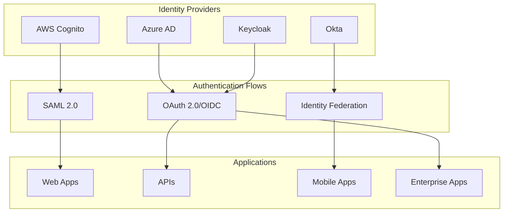

# Terraform Identity Provider Automation
{: .fs-9 }

Comprehensive Terraform modules for automated Identity Provider management across AWS Cognito, Azure AD, Okta, and Keycloak.
{: .fs-6 .fw-300 }

[Get started now](getting-started){: .btn .btn-primary .fs-5 .mb-4 .mb-md-0 .mr-2 } [View it on GitHub](https://github.com/sourabh-virdi/terraform-idp-automation){: .btn .fs-5 .mb-4 .mb-md-0 }

---

## 🚀 What is Terraform IdP Automation?

Terraform IdP Automation is a comprehensive platform that enables organizations to provision and manage Identity Providers (IdPs) using Infrastructure as Code principles. Instead of manually configuring each identity provider through different admin consoles, you can define your entire identity infrastructure in code, version it, test it, and deploy it consistently across environments.

### ✨ Key Features

- **🏗️ Modular Architecture**: Independent modules for AWS Cognito, Azure AD, Okta, and Keycloak
- **🔗 Multi-Provider Federation**: Seamless integration between different identity providers
- **🛡️ Security First**: Built-in security best practices and compliance frameworks
- **🔄 GitOps Ready**: Complete CI/CD pipeline with automated testing and deployment
- **📚 Comprehensive Documentation**: Detailed guides, examples, and best practices
- **🧪 Thoroughly Tested**: Automated testing from unit tests to integration tests

### 🎯 Use Cases

- **Enterprise SSO**: Rapidly deploy Single Sign-On across multiple applications
- **Multi-Cloud Identity**: Manage identity across AWS, Azure, and hybrid environments
- **Development Sandboxes**: Quickly spin up identity infrastructure for testing
- **Compliance Requirements**: Meet SOC2, FedRAMP, and other compliance standards
- **Identity Modernization**: Migrate from legacy identity systems to modern providers

## 🏗️ Architecture Overview



## 🚀 Quick Start

Get started with Terraform IdP Automation in just a few steps:

### 1. Prerequisites

- [Terraform](https://terraform.io/downloads) >= 1.0
- [Git](https://git-scm.com/downloads)
- Account access to your chosen identity provider(s)

### 2. Clone and Initialize

```bash
git clone https://github.com/sourabh-virdi/terraform-idp-automation.git
cd terraform-idp-automation
terraform init
```

### 3. Deploy Your First Identity Provider

```bash
# Start with AWS Cognito
cd examples/aws-cognito-basic
cp terraform.tfvars.example terraform.tfvars
# Edit terraform.tfvars with your settings
terraform plan
terraform apply
```

### 4. Explore Multi-Provider Integration

```bash
# Try the multi-provider example
cd examples/multi-provider
# Configure variables for your environment
terraform apply
```

[→ See the complete setup guide](getting-started)

## 📦 Available Modules

<div class="code-example" markdown="1">

### AWS Cognito Module
Complete AWS Cognito User Pool and Identity Pool management with SAML integration.

**Features**: User pools, Identity pools, SAML providers, Custom domains, IAM roles
</div>

<div class="code-example" markdown="1">

### Azure AD Module
Comprehensive Azure AD application registration and enterprise SSO management.

**Features**: App registration, Service principals, Groups & roles, Graph API permissions
</div>

<div class="code-example" markdown="1">

### Okta Module
Full Okta application, user, and policy management with advanced authentication flows.

**Features**: SAML & OAuth apps, User/group lifecycle, MFA policies, Group rules
</div>

<div class="code-example" markdown="1">

### Keycloak Module
Self-hosted identity and access management with comprehensive customization.

**Features**: Realms, Clients, User federation, Identity brokering, Custom themes
</div>

[→ Explore all modules](modules/)

## 💡 Example Use Cases

### Enterprise Single Sign-On

```hcl
module "enterprise_sso" {
  source = "./modules/aws-cognito"
  
  user_pool_name = "enterprise-users"
  
  saml_providers = {
    "AzureAD" = {
      provider_name = "AzureAD"
      metadata_url  = module.azure_ad.metadata_url
    }
  }
  
  identity_pool_name = "enterprise-identity"
  create_identity_pool = true
}
```

### Multi-Provider Federation

```hcl
module "multi_provider_sso" {
  source = "./examples/multi-provider"
  
  environment = "production"
  
  # Configure multiple providers
  enable_cognito = true
  enable_azure_ad = true
  enable_okta = true
}
```

[→ See more examples](examples/)

## 📚 Documentation

- **[Getting Started](getting-started)**: Complete setup guide
- **[Modules](modules/)**: Detailed module documentation
- **[Examples](examples/)**: Working examples for common scenarios
- **[Blog](blog/)**: Technical deep dives and best practices
- **[API Reference](api/)**: Complete Terraform variable and output reference

## 🤝 Community & Support

- **GitHub Issues**: [Report bugs and request features](https://github.com/sourabh-virdi/terraform-idp-automation/issues)
- **Discussions**: [Community discussions and Q&A](https://github.com/sourabh-virdi/terraform-idp-automation/discussions)
- **Contributing**: [Contribution guidelines](contributing)

## 📊 Project Stats

- **🌟 Stars**: 
- **🍴 Forks**: 
- **📦 Releases**: 
- **🐛 Issues**: 
- **✅ CI Status**: 

## 📄 License

This project is licensed under the MIT License - see the [LICENSE](https://github.com/sourabh-virdi/terraform-idp-automation/blob/main/LICENSE) file for details.

---

### Recent Updates

- **🎉 v2.0.0**: Major release with Keycloak module and enhanced multi-provider federation
- **🔒 Enhanced Security**: Advanced security scanning and compliance features
- **📖 Documentation**: Comprehensive documentation site and tutorials
- **🧪 Testing**: Expanded test coverage with integration and security tests

[View all releases →](https://github.com/sourabh-virdi/terraform-idp-automation/releases) 